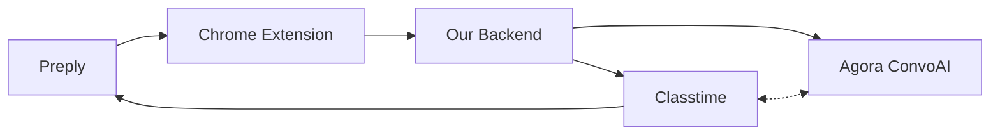
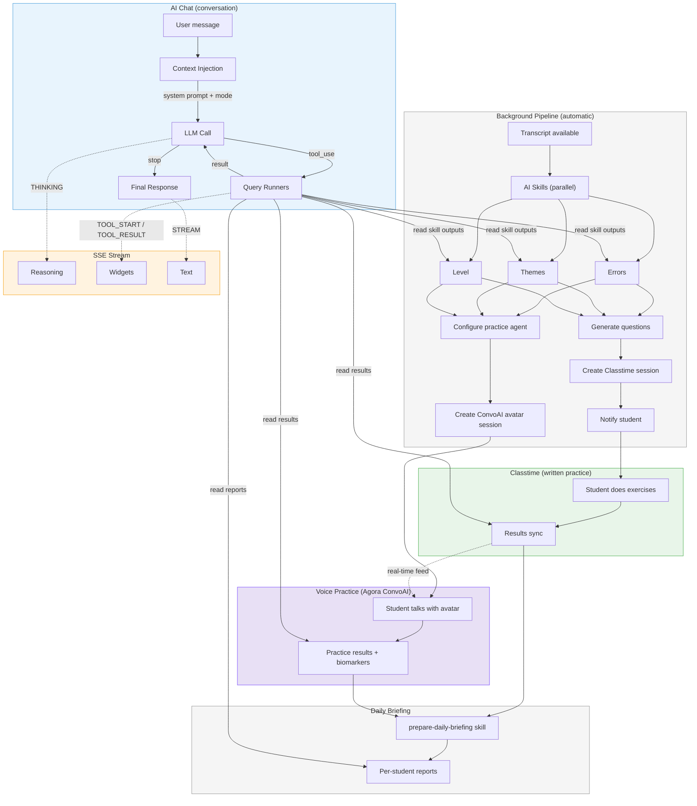

# Preply lesson intelligence

Better teaching, deeper learning - wherever the lesson happens.

A lot happens between lessons - but most of it happens outside Preply.
Our goal: own the space between lessons and make Preply a superpower
for both teachers and students.

Plan for the [Preply x Agora hackathon](https://luma.com/q52ol8od), March 20-21, 2026.

## The system

Five systems, one loop:



- **Preply** - where teachers and students already live. Auth, transcripts, messaging
- **Chrome Extension** - lives on Preply. Reads context, hosts AI chat, shows results
- **Our backend** - automated AI pipeline, orchestration, progress tracking
- **Classtime** - formative assessment, auto-grading, student UX
- **Agora ConvoAI** - voice practice with AI avatar, powered by lesson analysis, adapts to quiz results in real-time

**How it works:**

1. Lesson happens on Preply (or offline - Zoom, in-person, WhatsApp)
2. System analyzes the transcript - errors, themes, level assessment
3. Targeted exercises + AI avatar homework session created
4. Student practices: quiz exercises + conversation with the avatar
5. Quiz results feed the avatar in real-time - get articles wrong, the avatar shifts to article practice
6. Teacher gets a morning briefing - scores, practice data, what to focus on

### Under the hood



**Background pipeline** - runs automatically after each lesson. Skills
analyze the transcript in parallel (errors, themes, level), generate
targeted Classtime questions, configure the ConvoAI practice agent,
create both sessions, notify the student. No teacher action required.

**Classtime** - written practice. Production-ready assessment UX,
auto-grading, immediate feedback. Results sync back to our backend
and feed into the voice practice avatar in real-time.

**Voice practice (Agora ConvoAI)** - the student talks with an AI avatar
that knows their specific errors, lesson themes, and level. Classtime
quiz results feed in live - get articles wrong, the avatar shifts to
article practice. Thymia voice biomarkers detect stress and confidence,
adapting the avatar's pace and encouragement.

**Daily briefing** - aggregates all students' skill outputs, Classtime
scores, and voice practice data into per-student reports for the teacher.

**AI chat** - the text-based conversational layer. Query tools read from
skill outputs, practice results, and reports. Two modes:
- **Student practice** - "What errors should I focus on?", "Explain the
  past tense rule", "How is my level?"
- **Teacher daily briefing** - "Show today's overview", "How did Maria do?",
  "What should I focus on with Pierre?"

**SSE stream** - real-time events from the agent loop to the chat UI.
Reasoning traces (THINKING), tool steps (TOOL_START/RESULT with widgets),
streaming text. Trust through transparency - the user sees what the AI
did and why.

## Standing on the shoulders of giants

Our AI architecture is adapted from [PostHog AI](https://github.com/PostHog/posthog)
(`ee/hogai/`) - a production system with 70+ tools, Temporal workflows, and
streaming infrastructure serving thousands of users. We studied their patterns,
took what fits our domain, and skipped what doesn't.

**What we borrowed:**
- **Tool system** - dual-return `(message, data)` pattern, extensible QueryRunner registry
- **Agent loop** - simple while-loop over framework graphs (PostHog themselves recommend against LangGraph)
- **Context injection** - multi-layer context as competitive moat, prompt caching
- **Streaming** - SSE with progressive trust disclosure, message merging by ID
- **Trust principles** - show every step, make reasoning transparent, let users verify

**What makes us different:**
PostHog analyzes product data. We analyze teaching. Our competitive advantage
is **pedagogically grounded reasoning** - every error categorized against
established error taxonomy, every level assessed against CEFR descriptors,
every question designed with learning theory.

See [docs/deep-dives/](docs/deep-dives/) for the full analysis - 9 numbered
deep dives showing what PostHog does, what we take, and what we skip.

## Quick start

```bash
brew install uv bun mprocs       # prerequisites
git clone git@github.com:vasyl-stanislavchuk/prepy-loop-your-lesson.git
cd prepy-loop-your-lesson
make setup                        # install deps, start Redis, run migrations
cd backend && uv run python manage.py seed_demo   # seed demo data
make dev                          # start everything
```

Open http://localhost:8006/students to browse students and lessons.

Full setup guide: **[docs/getting-started.md](docs/getting-started.md)**

## Docs

| Doc | What it covers |
|-----|---------------|
| [docs/pitch.md](docs/pitch.md) | Why we're building this |
| [docs/prd.md](docs/prd.md) | Problem space, Preply analysis, competitive landscape |
| [docs/architecture.md](docs/architecture.md) | How the five systems connect |
| [docs/development-plan.md](docs/development-plan.md) | Hackathon execution: 3 tracks, phases, contracts |
| [docs/skill-system.md](docs/skill-system.md) | AI pipeline: skills, execution, output requirements |
| [docs/conversational-ux.md](docs/conversational-ux.md) | AI chat: modes, tools, widgets, trust, conversation flows |
| [docs/scaffolding.md](docs/scaffolding.md) | Tech stack, two repos, project structure, CLI bridge |
| [docs/classtime-api-guide.md](docs/classtime-api-guide.md) | Classtime API: auth, questions, sessions, Django models |
| [docs/opportunities.md](docs/opportunities.md) | Research-backed opportunity map, focus areas, pitch sharpening |

### Deep dives

Production patterns from PostHog, adapted for our system. Read in order.

| # | Deep dive | What it covers |
|---|-----------|---------------|
| 01 | [Django patterns](docs/deep-dives/01-django-patterns.md) | Models, services, exceptions, Pydantic validation |
| 02 | [State persistence](docs/deep-dives/02-state-persistence.md) | SkillExecution state machine, two-repo model |
| 03 | [Tool system](docs/deep-dives/03-tool-system.md) | PreplyTool, dual-return, QueryRunner registry |
| 04 | [Agent loop](docs/deep-dives/04-agent-loop.md) | While-loop agent, modes, tool dispatch |
| 05 | [Context injection](docs/deep-dives/05-context-injection.md) | 4-layer subject-aware context, prompt caching |
| 06 | [Streaming](docs/deep-dives/06-streaming.md) | SSE events, message merging, trust layers |
| 07 | [Trust and transparency](docs/deep-dives/07-trust-and-transparency.md) | Trust stack, ProcessTimeline, approval flow |
| 08 | [Frontend UX](docs/deep-dives/08-frontend-ux.md) | Widgets, components, loading states |
| 09 | [Visual design system](docs/deep-dives/09-visual-design-system.md) | Colors, typography, spacing, animation, accessibility |

## Repos

| Repo | Purpose |
|------|---------|
| `prepy-loop-your-lesson` | Docs, backend (Django), frontend (React), Chrome extension, infra |
| `preply-lesson-ai-skills` | AI skills, pedagogical theory, reference materials, CLI |

All docs live in [`docs/`](docs/).
