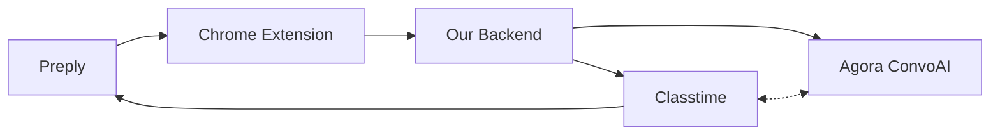
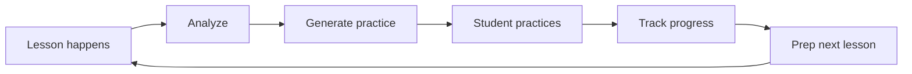
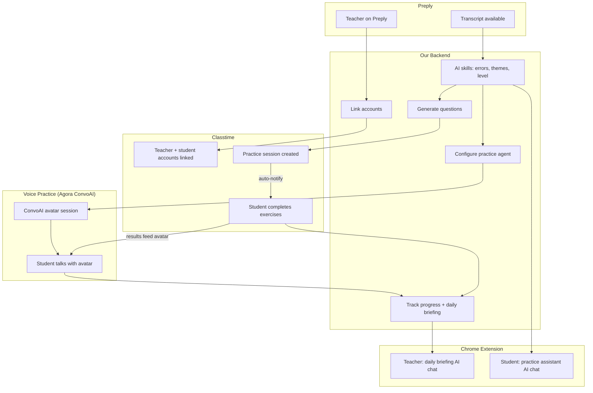

# Architecture

How the systems connect. For problem context, see [prd.md](prd.md).
For tech stack and project structure, see [scaffolding.md](scaffolding.md).

## High level

Five systems, one loop:



- **Preply** - where teachers and students already live. Auth, transcripts, messaging
- **Chrome Extension** - lives on Preply. Reads context, hosts AI chat, shows results
- **Our backend** - automated AI pipeline, orchestration, ConvoAI agent configuration
- **Classtime** - formative assessment. Questions, sessions, auto-grading, student UX
- **Agora ConvoAI** - voice practice with AI avatar, powered by lesson analysis, adapts to quiz results in real-time

## The loop

Every lesson feeds the same cycle. Start simple:



Now with system ownership:



## Step by step

### 1. Teacher opens Preply - extension reads context

Teacher is already logged into Preply. The extension's content script detects
the page and reads:
- Teacher identity (name, ID)
- Which student they're looking at (if on a student page)
- Lesson transcripts (linked to this teacher/student pair, fed through
  our interface or emulated data if Preply API doesn't expose them)

No separate login. The extension inherits Preply's session.

### 2. Accounts linked across systems

On first use, our backend maps the Preply teacher to both our system and
Classtime:

```
Preply teacher ID
  -> Our backend creates/gets internal user
  -> Classtime: getOrCreateAccount(preply_teacher_id) -> classtime_account_id
  -> Classtime: associateMember(org_id, classtime_account_id) -> added to Preply org
  -> Classtime: createToken(classtime_account_id) -> 7-day JWT
  -> Token cached on Teacher model, refreshed when expired
```

When a student is assigned practice, same flow without org association:
```
Preply student ID
  -> Classtime: getOrCreateAccount(preply_student_id) -> classtime_account_id
  -> Classtime: createToken(classtime_account_id) -> 7-day JWT
```

Both teacher and student have linked accounts. Progress persists, names are
real, identities are stable. See
[classtime-api-guide.md section 9](classtime-api-guide.md#9-auth) for details.

### 3. System analyzes the transcript (automatic)

When a transcript is available, the backend pipeline runs automatically:

```
Transcript + student context (level, language)
  -> AI skills run in parallel:
     - Errors: grammar, vocabulary, pronunciation, fluency
     - Themes: topics covered, vocabulary clusters
     - Level: CEFR assessment, strengths, gaps
  -> Structured outputs stored in SkillExecution records
```

No teacher action required. Each skill is independent and pluggable  - add
new ones without changing the pipeline.

### 4. Practice session created on Classtime (automatic)

From the analysis, the system generates targeted exercises and creates
the session  - no teacher preview or approval needed:

```
Skill outputs (errors, themes, level)
  -> AI picks question types per finding:
     Conjugation error -> fill-in-the-gap
     Word order mistake -> sorter
     Vocabulary gap -> categorizer
     Grammar rule -> single choice / true-false
  -> System pushes to Classtime:
     Library.createQuestionSet
     Library.createLibraryQuestion x N
     Session.createSession
  -> Session link sent to student automatically
```

### 5. Student practices: exercises + voice avatar

Student receives the homework link. Two practice surfaces from the same
lesson analysis:

**Classtime (written practice)**
- Exercises built from the student's actual errors
- 11 question types, 9 auto-graded with immediate feedback
- Score tracking, completion rate

**Agora ConvoAI (voice practice)**
- AI avatar knows the student's errors, themes, and level
- Classtime quiz results feed into the avatar in real-time via Agora RTM
- Get articles wrong in the quiz? The avatar shifts conversation to
  article practice
- Thymia voice biomarkers detect stress and confidence, adapting the
  avatar's pace and encouragement
- Anam provides video avatar with lip-sync

The student can also open the text-based AI chat widget to explore their
analysis: "What errors should I focus on?", "Explain the past tense rule",
"How is my level?" See [conversational-ux.md](conversational-ux.md) for
the student practice mode.

### 6. Results flow back

As the student practices, results sync to our backend:
- Classtime API (answers, scores, summaries)
- ConvoAI practice data (topics covered, conversation quality)
- Thymia biomarker signals (stress, confidence over time)
- Which errors the student got right/wrong across both surfaces

### 7. Teacher gets morning briefing

Before the day starts, the system prepares a daily briefing:

```
Upcoming students for today
  -> For each: latest skill outputs + practice results + scores
  -> prepare-daily-briefing skill produces per-student report
  -> Teacher opens extension, sees overview via AI chat
```

The teacher asks conversationally: "Show today's overview", "How did Maria
do?", "What should I focus on with Pierre?" The AI reads from prepared
reports. See [conversational-ux.md](conversational-ux.md) for the daily
briefing mode.

What the teacher sees per student:
- **Practice completion** - did they do it? What score?
- **Key patterns** - what errors persist? What's improving?
- **Suggested focus** - AI-generated recommendation for today's lesson

Each lesson makes the next briefing more useful.

## What each system does best

| System | Strength | We use it for |
|--------|----------|---------------|
| Preply | Teacher and student are already there | Identity, messaging, lesson data |
| Chrome Extension | Lives in teacher's and student's workflow | AI chat, context reading, auth bridge |
| Our backend | Automated AI pipeline, cross-session intelligence | Analysis, question generation, agent configuration, progress, daily briefings |
| Classtime | Formative assessment UX, 11 question types | Written practice, auto-grading, student experience, results |
| **Agora ConvoAI** | Real-time voice AI with avatar, adapts to student context | Voice practice powered by lesson analysis, quiz results feed in real-time, biomarker-adaptive pacing |

Preply for identity and communication. Our backend for intelligence.
Classtime for written assessment. Agora ConvoAI for voice practice. The
extension connects them.

### Voice practice layer (Agora ConvoAI)

The ConvoAI avatar turns lesson analysis into spoken practice. The backend
configures a practice agent per student - system prompt grounded in their
errors, themes, and level. The `configure-practice-agent` skill produces
the conversation plan with pedagogical judgment (which errors to weave in,
when to correct vs. let self-correct, how to scaffold difficulty).

**The real-time feedback loop:**
Classtime quiz results → Agora RTM → ConvoAI agent context update. Student
gets articles wrong in the quiz, the avatar shifts conversation to article
practice. This is the key innovation - written and spoken practice feed
each other.

**Supporting tech:**
- **Agora RTC** - real-time audio/video between student and avatar
- **Agora RTM** - real-time data channel for quiz results, biomarkers, corrections
- **Anam** - video avatar with lip-sync, natural idle animations
- **Thymia** - voice biomarkers (stress, emotion, confidence) adapt avatar behavior
- **Custom LLM server** - middleware between Agora ConvoAI and the LLM, injects
  lesson context, handles Thymia signals

For how AI skills are structured, executed, and tracked, see
[skill-system.md](skill-system.md). For how the AI chat works (modes,
tools, widgets, trust), see [conversational-ux.md](conversational-ux.md).
