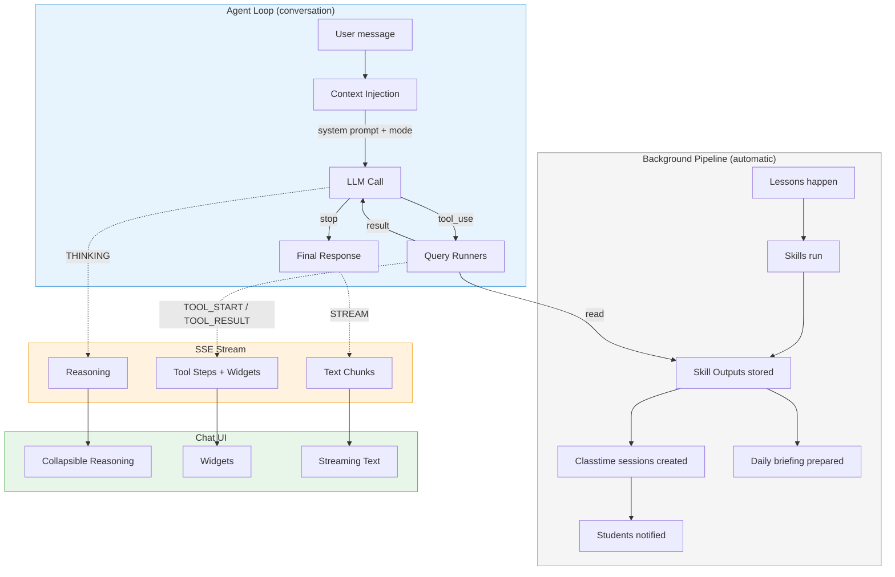
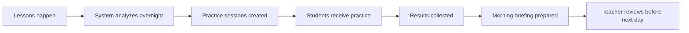

# Conversational UX

How teachers and students interact with Preply AI inside the Chrome extension.
See [architecture.md](architecture.md) for how systems connect.
See [skill-system.md](skill-system.md) for how AI skills work.
See [scaffolding.md](scaffolding.md) for tech stack and project structure.
See [deep-dives/09-visual-design-system.md](deep-dives/09-visual-design-system.md) for visual styling rules.

## System overview



## Glossary

| Term | What it is |
|------|-----------|
| **Agent loop** | While-loop that calls the LLM, executes tools, streams results  - no framework |
| **Context injection** | Data layers (lesson, student, pedagogy) injected into the system prompt before conversation starts |
| **Tool** | A function the AI can call. Returns `(message, data)`  - message for reasoning, data for widgets |
| **Skill output** | Structured data produced by a skill (errors, themes, level assessment). Stored in `SkillExecution.output_data`. Query tools read from these |
| **Query runner** | A tool subtype that runs a structured query against skill outputs or the backend. Pydantic schema in, `(message, data)` out. Scales without boilerplate |
| **Widget** | React component that renders structured tool data as interactive UI (error lists, practice cards) |
| **Mode** | A focused configuration: system prompt, tool set, context layers, suggestion chips |
| **Reasoning** | `THINKING` events that surface the AI's thought process as collapsible blocks  - the trust mechanism |
| **SSE stream** | Server-sent events that push agent loop output to the frontend in real-time |
| **Approval gate** | Pause before write operations (e.g., sending practice to student). User confirms or denies |
| **Dual-return** | Every tool returns both `message` (for the LLM) and `data` (for a widget). Same call → conversation + UI |
| **Skill** | A long-running AI workflow defined in skill-system.md. Analysis tools wrap skills as tool calls |

---

## Why this matters

The extension side panel is a conversational AI, not a dashboard with buttons.
Teachers drill into findings, ask follow-ups, adjust recommendations. Students
see targeted feedback grounded in their actual lesson.

### Trust through transparency

The pitch identifies trust as the critical UX challenge  - Preply's Lesson
Insights feel like surveillance. Our system earns trust by showing its work:

- **Layer 1  - Reasoning**: collapsible `THINKING` blocks show what framework
  the AI applied and why ("Applied CEFR B1 descriptors → past tense errors
  marked as moderate")
- **Layer 2  - Tool calls**: expandable steps show what the AI did, with
  parameters and duration
- **Layer 3  - Source attribution**: every finding links back to its transcript
  position

The teacher sees WHY the AI flagged something, not just WHAT it flagged.
Progressive disclosure: summary visible by default, details expandable.
Never overwhelm, always allow drill-down.

---

## How the system works

Analysis, session creation, and practice delivery happen **automatically
in the background**  - no teacher clicks required.



**Daily cycle:**

1. Teacher has 5 lessons in a day  - 5 students
2. After each lesson: system automatically processes transcript, runs
   skills (errors, themes, level), generates Classtime questions, creates
   sessions, sends to students
3. Students receive personalized formative assessments and can explore
   their analysis with the AI assistant
4. Students complete practice, results sync back
5. Next morning: system runs a prep skill  - takes all upcoming students,
   their session results, scores, completed assessments  - and prepares
   a per-student report
6. Teacher opens the extension, sees the morning briefing: who completed
   what, scores, what to focus on in each lesson today

The AI assistant is for **consuming and exploring** this data  - not for
triggering it.

## Modes

The hackathon focuses on fully working happy path first. 2 modes that cover
the complete loop. If time allows  - we'll add more.

### MVP mode 1: `daily_briefing` (teacher)

Teacher opens the extension in the morning. The system has already:
- Analyzed all yesterday's lessons
- Created and sent practice sessions
- Collected completion data and scores
- Prepared a per-student report for today's upcoming lessons

The teacher explores this data conversationally.

```typescript
export const DAILY_BRIEFING_MODE = {
  name: 'Daily briefing',
  description: 'Review student progress and prep for today\'s lessons.',
  tools: [
    { name: 'query_daily_overview', description: 'Get overview of all students for today' },
    { name: 'query_student_report', description: 'Get detailed report for a specific student' },
    { name: 'query_errors', description: 'Search errors by type or severity for a student' },
    { name: 'query_themes', description: 'Search themes and vocabulary from a student\'s lessons' },
    { name: 'query_practice_results', description: 'Get practice completion and scores' },
  ],
  suggestion_chips: ['Show today\'s overview', 'How did Maria do?', 'Who needs attention?'],
} as const
```

```python
DAILY_BRIEFING_INSTRUCTIONS = (
    "You are helping a teacher prepare for today's lessons. "
    "The system has already analyzed lessons, created practice, and collected results. "
    "Lead with actionable insights: who completed practice, what scores, what to focus on. "
    "When the teacher asks about a specific student, show their report with errors, "
    "practice results, and suggested focus for today's lesson. "
    "Be concise  - prioritize what changed since the last lesson. "
    "Flag students who didn't complete practice or scored low."
)
```

### MVP mode 2: `student_practice` (student)

Student opens the AI widget during or after a Classtime session. The
practice session is ready (or already completed). Skill outputs (errors,
themes, level) are already available  - the student explores them
conversationally.

Students have two practice surfaces:
- **Classtime exercises** (written)  - formative assessments targeting their errors
- **ConvoAI avatar** (voice)  - Agora ConvoAI voice practice for spoken fluency

The text-based AI chat serves as the exploration layer alongside these  -
students use it to understand their errors, ask about theory, and navigate
between written and voice practice.

```typescript
export const STUDENT_PRACTICE_MODE = {
  name: 'Practice assistant',
  description: 'Explore your lesson analysis. Understand errors, dive into theory, get guidance.',
  tools: [
    { name: 'query_errors', description: 'See errors from your lesson by type or severity' },
    { name: 'query_themes', description: 'See topics and vocabulary from your lesson' },
    { name: 'query_level', description: 'See level assessment and suggestions' },
    { name: 'get_practice_session', description: 'See your practice session status and link' },
    { name: 'get_voice_practice_session', description: 'Get the student\'s ConvoAI voice practice session link and status' },
  ],
  suggestion_chips: ['What errors should I focus on?', 'Explain this topic', 'How is my level?', 'Start voice practice'],
} as const
```

```python
STUDENT_PRACTICE_INSTRUCTIONS = (
    "You are helping a student understand their lesson analysis and practice. "
    "Skill outputs (errors, themes, level) are already available  - query them, don't re-analyze. "
    "Be encouraging but specific. When explaining errors, teach the underlying rule. "
    "Reference the original lesson moments where errors occurred. "
    "If the student asks about theory, explain at their CEFR level. "
    "The Classtime practice session may be ready or completed  - "
    "help the student understand what to focus on and why."
)
```

### Future modes

| Mode | Focus | When |
|------|-------|------|
| `lesson_deep_dive` | Teacher drills into a specific lesson's analysis in detail | When teacher wants to explore beyond the briefing |
| `voice_practice` | Agora ConvoAI avatar session for spoken practice, adapts to quiz results | After student completes Classtime exercises |
| `cross_session_review` | Progress trends across multiple lessons per student | After we have multi-session data |

Adding a mode = define a mode entry (name, tools, chips) + add context
instructions in the backend prompt. The agent core doesn't change.

---

## Context injection

Data injected into the system prompt before the conversation starts. Enables
prompt caching (stable prefix) and means the AI can answer from context
without making tool calls.

### Context layers

```python
from pydantic import BaseModel, Field


class LessonContext(BaseModel):
    """Current lesson being analyzed."""
    lesson_id: str | None = None
    transcript_summary: str | None = None  # Short summary for system prompt (200-300 tokens)
    lesson_date: str | None = None
    duration_minutes: int | None = None
    subject_type: str | None = None       # "language", "math", "art", etc.
    subject_config: dict | None = None    # e.g. {"language_pair": "es-en", "l1": "Spanish", "l2": "English"}
    student_level: str | None = None      # Generic: CEFR for language, grade for math, etc.
    utterance_count: int = 0
    # Full transcript fetched via get_transcript_segment tool, not injected


class StudentContext(BaseModel):
    """Student being discussed."""
    student_id: str | None = None
    student_name: str | None = None
    l1: str | None = None  # Native language (language subjects)
    l2: str | None = None  # Learning language (language subjects)
    level: str | None = None  # Generic level (CEFR for language, grade for math)
    total_lessons: int = 0


class PedagogicalContext(BaseModel):
    """Schema that grounds the AI's reasoning. Subject-aware, loaded once."""
    subject_type: str                     # Drives which error types and level framework to use
    error_types: list[str] = Field(default_factory=list)  # Dynamic per subject_type
    severity_levels: list[Severity] = Field(default_factory=lambda: list(Severity))
    level_framework: str | None = None    # "CEFR" for language, None for others
    question_types: list[QuestionType] = Field(default_factory=lambda: list(QuestionType))
```

### How context appears in the system prompt

```
## Current lesson
- Subject: language (Spanish L1 → English L2)
- Student: Maria Garcia (student_42)
- Level: B1 (CEFR)
- Lesson: March 18, 2026 (50 min, 127 utterances)
- Summary: Covered travel planning and restaurant vocabulary. Teacher
  focused on past tense narrative and directions. Student engaged but
  consistent errors with past simple and articles.

## Pedagogical schema
- Subject: language
- Error types: grammar, vocabulary, pronunciation, fluency
- Severity: minor (expected at level), moderate (should be acquired), major (blocks communication)
- Level framework: CEFR (A1-C2)
- Question types: fill_gap, sorter, categorizer, single_choice, multiple_choice, boolean, cloze
```

### Transcript strategy

Transcripts can be large (10K+ tokens for a 50-minute lesson):

- **In context**: inject a short summary (200-300 tokens)
- **Via tool**: `get_transcript_segment` retrieves specific sections by
  timestamp or utterance range
- Summary is generated during pre-fetch, not by the AI

---

## Tool system

Tools follow the dual-return pattern: `execute() -> (message, data)`.
The message feeds the AI's reasoning; the data renders as a widget.

### Base class

```python
from abc import ABC, abstractmethod
from typing import Any

from pydantic import BaseModel


class PreplyTool(ABC):
    """Base class for Preply AI tools.

    All tools return (message, data):
    - message: natural language for the LLM
    - data: structured output for the frontend widget
    """

    @property
    @abstractmethod
    def name(self) -> str: ...

    @property
    @abstractmethod
    def description(self) -> str: ...

    @property
    @abstractmethod
    def args_schema(self) -> type[BaseModel]: ...

    @property
    def requires_approval(self) -> bool:
        return False

    @property
    def category(self) -> ToolCategory:
        return ToolCategory.RESEARCH

    @property
    def context_prompt(self) -> str | None:
        """Optional guidance injected into system prompt when tool is available."""
        return None

    @abstractmethod
    async def execute(self, **kwargs: Any) -> tuple[str, Any]:
        """Execute the tool. Returns (message_for_llm, data_for_widget)."""
        ...

    def validate_args(self, **kwargs: Any) -> BaseModel:
        return self.args_schema(**kwargs)
```

### Query runner pattern

For tools that run structured queries, use the QueryRunner pattern.
Pydantic schema defines the query; `execute()` runs it.
Scales without boilerplate:

```python
from pydantic import ConfigDict
from typing import ClassVar


class QueryRunner(BaseModel, ABC):
    """Base for query-based tools. Schema in, (message, data) out."""

    model_config = ConfigDict(frozen=True, extra="forbid")

    kind: ClassVar[str]
    widget_type: ClassVar[WidgetType | None] = None

    @classmethod
    @abstractmethod
    def get_description(cls) -> str: ...

    @abstractmethod
    async def execute(self, **kwargs: Any) -> tuple[str, Any]: ...
```

### Skill output types

Skills produce structured outputs stored in `SkillExecution.output_data`.
Query tools read from these outputs  - they don't touch the raw transcript.
Skills run automatically in the background after each lesson.

| Skill | Output type | What it contains |
|-------|------------|------------------|
| `analyze-lesson-errors` | `errors` | Errors with type, severity, original/corrected, explanation, reasoning, transcript position |
| `analyze-lesson-themes` | `themes` | Topic clusters, vocabulary lists, utterance counts, transcript ranges |
| `analyze-lesson-level` | `level_assessment` | CEFR level evaluation, strengths, gaps, suggestions for improvement |
| `generate-classtime-questions` | `practice_session` | Generated questions, session code, session URL |
| `prepare-daily-briefing` | `daily_report` | Per-student reports for upcoming lessons: errors, practice results, scores, suggested focus |

### MVP tool catalog

**Query tools** (instant, read from skill outputs):

| Tool | Reads from | Args | Returns |
|------|-----------|------|---------|
| `query_daily_overview` | `daily_report` | `teacher_id`, `date?` | All students for the day with status summary |
| `query_student_report` | `daily_report` + all skill outputs | `student_id` | Full report: errors, themes, practice results, suggested focus |
| `query_errors` | `errors` output | `student_id`, `lesson_id?`, `error_type?`, `severity?` | Filtered errors with reasoning → `ErrorAnalysisWidget` |
| `query_themes` | `themes` output | `student_id`, `lesson_id?`, `topic?` | Themes with vocabulary → `ThemeMapWidget` |
| `query_level` | `level_assessment` output | `student_id` | Level, strengths, gaps, suggestions |
| `query_practice_results` | Classtime API + backend | `student_id`, `session_code?` | Completion, scores, per-question results |
| `get_practice_session` | Classtime API | `student_id` or `session_code` | Session status, link, question count |

Query tools are available to both teacher and student (scoped by role).
No one triggers analysis  - they explore what the system already produced.

### Example query tool implementation

```python
class QueryErrorsArgs(BaseModel):
    student_id: str = Field(description="Student to query errors for")
    lesson_id: str | None = Field(default=None, description="Specific lesson, or latest if omitted")
    error_type: ErrorType | None = Field(default=None, description="Filter by error type")
    severity: Severity | None = Field(default=None, description="Filter by minimum severity")


class QueryErrorsTool(PreplyTool):
    name = "query_errors"
    description = "Get errors from a student's lesson analysis. Filter by type or severity."
    args_schema = QueryErrorsArgs
    category = ToolCategory.RESEARCH

    async def execute(self, student_id: str, **kwargs: Any) -> tuple[str, Any]:
        # Reads from SkillExecution.output_data where skill_name = "analyze-lesson-errors"
        # Filters by type/severity if provided
        # Returns structured result for ErrorAnalysisWidget

        execution = await get_latest_skill_execution(
            student_id=student_id,
            skill_name="analyze-lesson-errors",
            lesson_id=kwargs.get("lesson_id"),
        )
        errors = execution.output_data["errors"]

        # Apply filters
        if kwargs.get("error_type"):
            errors = [e for e in errors if e["type"] == kwargs["error_type"]]
        if kwargs.get("severity"):
            severity_order = list(Severity)
            min_idx = severity_order.index(kwargs["severity"])
            errors = [e for e in errors if severity_order.index(e["severity"]) >= min_idx]

        summary = execution.output_data["summary"]
        message = (
            f"Found {len(errors)} errors"
            f"{f' ({kwargs['error_type']})' if kwargs.get('error_type') else ''}: "
            f"most frequent: {summary['most_frequent']}."
        )

        data = {
            "widget_type": WidgetType.ERROR_ANALYSIS,
            "student_id": student_id,
            "total_errors": len(errors),
            "errors": [
                {
                    "type": e["type"],
                    "severity": e["severity"],
                    "original": e["original"],
                    "corrected": e["corrected"],
                    "explanation": e["explanation"],
                    "transcript_position": e["position"],
                    "reasoning": e["reasoning"],
                }
                for e in errors
            ],
        }

        return message, data
```

### Skill output requirements

Skills must include `reasoning` in their output  - explaining what framework
was applied and why. This is what makes the trust layer work:

```json
{
  "errors": [{
    "type": "grammar",
    "severity": "moderate",
    "original": "I go to the store yesterday",
    "corrected": "I went to the store yesterday",
    "explanation": "Past simple required for completed past action",
    "reasoning": "Error taxonomy: morphological > verb tense. B1 should have acquired past simple (CEFR B1: 'can narrate past events'). Marked moderate.",
    "position": {"utterance": 34, "timestamp": "12:45"}
  }]
}
```

---

## Widget system

Widgets render structured tool data as interactive UI in the chat.

### Widget routing

```typescript
import { WidgetType } from '@/lib/constants'

const WIDGET_MAP: Record<string, React.ComponentType<WidgetProps>> = {
    [WidgetType.ERROR_ANALYSIS]: ErrorAnalysisWidget,
    [WidgetType.THEME_MAP]: ThemeMapWidget,
    [WidgetType.PRACTICE_CARD]: PracticeCardWidget,
}

function ToolResultRenderer({ data }: ToolResultProps) {
    const Widget = WIDGET_MAP[data.widget_type]
    if (!Widget) return <DefaultToolResult data={data} />
    return <Widget data={data} />
}
```

### ErrorAnalysisWidget

Errors grouped by type with severity badges, corrections, and transcript
links. The primary widget for the MVP.

```typescript
interface ErrorItem {
    type: typeof ErrorType[keyof typeof ErrorType]
    severity: typeof Severity[keyof typeof Severity]
    original: string
    corrected: string
    explanation: string
    transcript_position: { utterance: number; timestamp: string }
    reasoning: string
}

interface ErrorAnalysisData {
    widget_type: typeof WidgetType.ERROR_ANALYSIS
    lesson_id: string
    total_errors: number
    errors_by_type: Record<string, number>
    errors: ErrorItem[]
}
```

```
┌─ Error analysis ─────────────────────────────┐
│ 9 errors found                               │
│ ■ Grammar (4)  ■ Vocabulary (3)  ■ Pron (2) │
│                                               │
│ ▾ Grammar errors                             │
│   ● moderate  "I go yesterday" → "I went..." │
│     Past simple required for completed action │
│     12:45 [▸ view in transcript]             │
│     [▸ reasoning: B1 should know past simple]│
│                                               │
│   ● moderate  "She have" → "She has"         │
│     Subject-verb agreement                    │
│     18:20 [▸ view in transcript]             │
│                                               │
│ ▸ Vocabulary errors (3)                      │
│ ▸ Pronunciation errors (2)                   │
└───────────────────────────────────────────────┘
```

### PracticeCardWidget

Generated Classtime session preview with action buttons.

```typescript
interface PracticeCardData {
    widget_type: typeof WidgetType.PRACTICE_CARD
    question_count: number
    question_types: Record<string, number>  // {GAP: 3, SORTER: 2, ...}
    focus_topic: string
    source_errors: Array<{ timestamp: string; original: string }>
    session_url?: string  // Set after session creation
}
```

```
┌─ Practice: past tense ───────────────────────┐
│ 8 exercises                                   │
│ 3× fill-in-gap  2× sorter  2× MC  1× cloze │
│                                               │
│ Source errors:                                │
│   • 12:45 "I go yesterday"                   │
│   • 24:10 "She walk to school last week"     │
│   • 31:55 "They are come from Spain"         │
│                                               │
│ [Preview questions]  [Send to student]        │
└───────────────────────────────────────────────┘
```

### ThemeMapWidget

Topic clusters with vocabulary. Lighter widget  - renders as collapsible
cards, no visualization needed for MVP.

```typescript
interface ThemeMapData {
    widget_type: typeof WidgetType.THEME_MAP
    themes: Array<{
        topic: string
        vocabulary: string[]
        utterance_count: number
        transcript_range: { start: string; end: string }
    }>
}
```

```
┌─ Lesson themes ──────────────────────────────┐
│ ▾ Travel planning (42 utterances)            │
│   airport, boarding pass, gate, departure,   │
│   arrival, luggage, terminal                 │
│   [▸ see in transcript: 2:00 - 18:30]       │
│                                               │
│ ▸ Restaurant vocabulary (31 utterances)      │
│ ▸ Giving directions (24 utterances)          │
└───────────────────────────────────────────────┘
```

### Future widgets (post-hackathon)

| Widget | For mode | What it shows |
|--------|---------|---------------|
| `ProgressChartWidget` | `cross_session_review` | Error counts across sessions, trend arrows |
| `PrepBriefWidget` | `lesson_prep` | Improving / persistent / new, suggested focus |

---

## Agent loop

A while-loop  - no framework, no graph, no orchestration library.

```
User message
  → Build context (Student, Pedagogical, skill outputs summary)
  → Call Claude API with query tools
  → Tool needed?
      → Query tool? → Read from skill outputs → Return with widget → Loop back
  → No: Stream final response (with THINKING events)
  → Messages persisted to Conversation + ChatMessage models on every turn
```

All tools in the MVP are query tools  - they read from pre-computed skill
outputs. No long-running analysis in the agent loop. Skills run in the
background pipeline, not during conversation.

### Key design points

**Query-only agent**: the agent reads from structured skill outputs (errors,
themes, level, daily reports). Same query tools serve both teacher and
student modes, scoped by role.

**Reasoning transparency**: the system prompt instructs the AI to emit
reasoning  - what framework it applied, what evidence it considered, why it
reached its conclusion. This powers trust layer 1.

**Safety**: `max_iterations = 10`. Conversations typically need
2-3 iterations (overview → drill down → explore theory).

---

## Streaming UX

SSE events from the agent loop to the frontend:

| Event | When | Frontend renders | Trust layer |
|-------|------|-----------------|-------------|
| `STATUS` | Agent thinking | "Loading..." status bar |  - |
| `THINKING` | Agent reasoning | Collapsible reasoning block | Layer 1: shows WHY |
| `TOOL_START` | Query tool starting | Expandable step with name + input | Layer 2: shows WHAT |
| `TOOL_RESULT` | Query completed | Widget with source attribution | Layer 3: shows WHERE from |
| `STREAM` | AI commentary | Streaming text alongside widgets | Narrative |
| `COMPLETE` | Turn done | Stop indicators |  - |

### What the teacher sees

```
┌─────────────────────────────────────────────┐
│ Teacher: "How did Maria do?"                │
│                                             │
│ ▸ Reasoning: "Pulling Maria's report:      │
│   errors, practice results, suggested focus"│
│                                             │
│ ▸ query_student_report (12ms) ✓             │
│                                             │
│ AI: Maria  - last lesson March 11:           │
│                                             │
│ ┌─ ErrorAnalysisWidget ──────────────────┐  │
│ │ 9 errors: Grammar (4) Vocab (3) Pr (2) │  │
│ │ ▸ Grammar errors                       │  │
│ │ ▸ Vocabulary errors                    │  │
│ └────────────────────────────────────────┘  │
│                                             │
│ Practice: 75%  - strong on conjugation,      │
│ weak on word order.                         │
│ Suggested focus: past tense in narratives.  │
│                                             │
│ [Show her errors]  [Practice details]       │
└─────────────────────────────────────────────┘
```

---

## Happy path

The full daily cycle. The system does the work; humans explore the results.

**Background (automatic, no UI):**

**1. Lessons happen** (architecture.md)
Teacher has 5 lessons today  - Maria, Alex, Yuki, Pierre, Ana.

**2. System processes each lesson** (skill-system.md: worker flow)
After each lesson, the system automatically:
- Fetches transcript
- Runs skills in parallel: `analyze-lesson-errors`, `analyze-lesson-themes`, `analyze-lesson-level`
- Generates Classtime questions from findings
- Creates practice sessions, sends links to students

**3. Students receive personalized practice**
Each student gets a Classtime link with exercises targeting their
specific errors from their specific lesson.

**Student side (MVP mode 2: `student_practice`):**

**4. Student opens AI widget**
During or after the Classtime session. Skill outputs already available.

**5. Student: "What errors should I focus on?"**
AI calls `query_errors`  - reads from skill outputs, explains at their level.

**6. Student: "Explain the past tense rule"**
AI reasons from skill outputs + pedagogical context. Teaches the underlying
rule using the student's own errors as examples.

**7. Student completes written practice** (architecture.md: steps 5-6)
Classtime handles exercises, auto-grading, immediate feedback. Results sync.

**7b. Student opens ConvoAI avatar for voice practice**
After completing Classtime exercises, the student can open the Agora ConvoAI
avatar for spoken practice. The avatar knows the student's quiz results and
adapts its conversation prompts accordingly  - reinforcing weak areas from
the written exercises through spoken dialogue.

**Teacher side (MVP mode 1: `daily_briefing`):**

**8. Morning: system prepares briefing** (automatic)
`prepare-daily-briefing` skill runs overnight. Takes all upcoming students
for today, pulls their latest skill outputs, practice results, scores.
Produces a per-student report with suggested focus areas.

**9. Teacher opens extension before the day starts**
`daily_briefing` mode active. Reports already available.

**10. Teacher: "Show today's overview"**
AI calls `query_daily_overview`. Shows all 5 students: who completed
practice, scores, key patterns, who needs attention.

**11. Teacher: "How did Maria do?"**
AI calls `query_student_report`. Shows Maria's errors, practice score
(75%, strong on conjugation, weak on word order), suggested focus for
today's lesson.

**12. Teacher: "What should I focus on with Maria today?"**
AI reasons from the report  - "Past tense word order. She conjugates
correctly but struggles with sentence structure. Try narrative exercises."

**13. Lessons happen** → cycle repeats

---

## Conversation flows

### Teacher flow (`daily_briefing` mode)

Teacher opens the extension in the morning. All data is already prepared.

```
Teacher: "Show today's overview"

  [TOOL_START: query_daily_overview  - date: today]

AI: "You have 5 lessons today. Overview:

     Maria Garcia (B1, 10:00)  - practice 75%, past tense persistent ⚠
     Alex Chen (A2, 11:00)  - practice 90%, improving across the board ✓
     Yuki Tanaka (B2, 13:00)  - practice not started ✗
     Pierre Dubois (B1, 14:00)  - practice 60%, articles still weak ⚠
     Ana Silva (A2, 15:00)  - first lesson, no history

     Yuki hasn't started practice. Maria and Pierre need targeted focus."

  [How did Maria do?]  [What about Yuki?]  [Who needs attention?]
```

```
Teacher: "How did Maria do?"

  [THINKING  - collapsible]
  "Pulling Maria's student report: errors, practice results, suggested focus."

  [TOOL_START: query_student_report  - student: maria_42]

AI: "Maria Garcia  - last lesson March 11:

     Errors: 9 found (4 grammar, 3 vocabulary, 2 pronunciation)
     Key pattern: past tense (3 occurrences, moderate severity)

     Practice: 75%  - 6/8 correct
     ✓ Strong: conjugation (fill-in-gap 3/3)
     ✗ Weak: word order with time expressions (sorter 0/2)

     Suggested focus for today: past tense in narrative contexts.
     She conjugates correctly in isolation but struggles with word
     order in full sentences. Try storytelling exercises."

  [Show her errors]  [What about her vocabulary?]  [Next student]
```

```
Teacher: "Show her errors"

  [TOOL_START: query_errors  - student: maria_42, lesson: latest]

  [TOOL_RESULT: ErrorAnalysisWidget]

AI: "4 grammar errors, most significant:
     1. At 12:45  - 'I go to the store yesterday' → 'went'
        [▸ reasoning: B1 should know past simple]
     2. At 18:20  - 'She have two brothers' → 'has'
        [▸ reasoning: subject-verb agreement]

     The past tense errors are the priority  - they've been
     consistent across lessons and her practice scores confirm
     she needs more work on sentence-level application."
```

### Student flow (`student_practice` mode)

Student opens the AI widget during or after the Classtime session.
Skill outputs are already available  - the student explores, not triggers.

```
Student: "What errors should I focus on?"

  [TOOL_START: query_errors  - severity: moderate+major]

  [TOOL_RESULT: ErrorAnalysisWidget  - student view]

AI: "You had 4 errors worth focusing on. The biggest pattern:
     past tense  - you said 'I go yesterday' instead of 'I went.'
     This came up 3 times in your lesson.

     The rule: when talking about finished past actions, English
     uses past simple (went, saw, ate), not present tense.

     Your practice exercises 1-3 target exactly this. Want me
     to explain the rule in more detail, or look at another area?"

  [Explain past tense]  [Show all errors]  [How is my level?]
```

```
Student: "How is my level?"

  [TOOL_START: query_level  - student: me]

AI: "Based on this lesson, you're solidly B1. Here's what that means:

     ✓ Strengths: you can discuss familiar topics (travel, restaurants),
       use a good range of vocabulary, and maintain a conversation.

     → Work on: past tense consistency (you know the forms but mix up
       when to use them), and article usage ('the' vs 'a').

     These are typical B1 patterns  - you're building the right
     foundation. The practice session focuses on exactly these areas."

  [Show my errors]  [Explain articles]  [Open practice]
```

```
Student: "Explain the past tense rule"

AI: "In English, when you talk about something that already happened
     and is finished, you use past simple:

     ✓ 'I went to the store yesterday' (finished action)
     ✗ 'I go to the store yesterday'

     The key signal words: yesterday, last week, ago, in 2023.

     From your lesson at 12:45, you said:
     'I go to the store yesterday'  - here 'yesterday' tells us
     it's finished, so we need 'went.'

     Your practice has 3 fill-in-the-gap exercises on exactly
     this pattern. Want to try them?"

  [Open practice]  [More examples]  [Next topic]
```

---

## Key design decisions

| Decision | Choice | Why |
|----------|--------|-----|
| Agent framework | While-loop, no framework | Full control, no dependency |
| Query from skill outputs | Query tools read from structured skill data | Same tools serve teacher + student; no raw transcript parsing at query time |
| Skill execution | Background pipeline, not in conversation | Agent only queries results; skills run automatically |
| Widget rendering | Client-side React, `widget_type` routing | Interactive, expandable |
| Trust model | Reasoning traces + source attribution + approval gates | Solves surveillance problem |
| Progressive disclosure | Summary default, details expandable | Never overwhelm |
| Constants | Shared enums, no hardcoded strings | Consistent across backend + frontend |

---

## Implementation sequence

Trust is built in from step 1.

**1. Background pipeline + student practice mode** (MVP core)
- Automated skill execution pipeline: lessons → analysis → session creation
- `student_practice` mode with query tools (`query_errors`, `query_level`)
- ErrorAnalysisWidget
- `THINKING` + `TOOL_START` transparency events
- Minimum demo: student opens widget, explores errors, gets theory explained

**2. Teacher daily briefing**
- `prepare-daily-briefing` skill (runs overnight, produces per-student reports)
- `daily_briefing` mode with `query_daily_overview`, `query_student_report`
- Teacher sees all students, scores, focus areas before the day starts

**3. Richer query tools**
- `query_themes` + ThemeMapWidget
- `query_practice_results` with detailed per-question breakdown
- `get_practice_session` for session status/link

**4. Post-hackathon**
- `lesson_deep_dive` mode for detailed single-lesson exploration
- `cross_session_review` mode with ProgressChartWidget
- `run_gap_analysis` skill
- Confidence indicators, feedback learning

---

## Constants

Shared across backend, frontend, and skill definitions. Avoid hardcoded strings.

```python
from enum import StrEnum


class ErrorType(StrEnum):
    GRAMMAR = "grammar"
    VOCABULARY = "vocabulary"
    PRONUNCIATION = "pronunciation"
    FLUENCY = "fluency"


class Severity(StrEnum):
    MINOR = "minor"        # Expected at this level
    MODERATE = "moderate"  # Should be acquired by this level
    MAJOR = "major"        # Blocks communication


class CEFRLevel(StrEnum):
    A1 = "A1"
    A2 = "A2"
    B1 = "B1"
    B2 = "B2"
    C1 = "C1"
    C2 = "C2"


class QuestionType(StrEnum):
    """Classtime question types. See classtime-api/hackathon-api-guide.md."""
    FILL_GAP = "GAP"
    SORTER = "SORTER"
    CATEGORIZER = "CATEGORIZER"
    SINGLE_CHOICE = "SINGLE_CHOICE"
    MULTIPLE_CHOICE = "MULTIPLE_CHOICE"
    BOOLEAN = "BOOLEAN"
    CLOZE = "CLOZE"


class SkillOutputType(StrEnum):
    ERRORS = "errors"
    THEMES = "themes"
    LEVEL_ASSESSMENT = "level_assessment"


class WidgetType(StrEnum):
    ERROR_ANALYSIS = "error_analysis"
    THEME_MAP = "theme_map"
    PRACTICE_CARD = "practice_card"


class ToolCategory(StrEnum):
    RESEARCH = "research"
    ANALYSIS = "analysis"
    EXECUTION = "execution"


class StreamEventType(StrEnum):
    STATUS = "status"
    THINKING = "thinking"
    TOOL_START = "tool_start"
    TOOL_RESULT = "tool_result"
    STREAM = "stream"
    COMPLETE = "complete"
```

```typescript
// frontend/src/lib/constants.ts
export const ErrorType = {
  GRAMMAR: 'grammar',
  VOCABULARY: 'vocabulary',
  PRONUNCIATION: 'pronunciation',
  FLUENCY: 'fluency',
} as const

export const Severity = {
  MINOR: 'minor',
  MODERATE: 'moderate',
  MAJOR: 'major',
} as const

export const WidgetType = {
  ERROR_ANALYSIS: 'error_analysis',
  THEME_MAP: 'theme_map',
  PRACTICE_CARD: 'practice_card',
} as const

export const StreamEventType = {
  STATUS: 'status',
  THINKING: 'thinking',
  TOOL_START: 'tool_start',
  TOOL_RESULT: 'tool_result',
  STREAM: 'stream',
  COMPLETE: 'complete',
} as const
```
