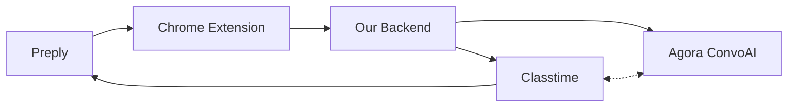

# Pitch

Every lesson keeps teaching, long after it ends.

What makes Preply different is the person on the other side of the screen.
A good tutor turns 50 minutes into something that changes how a student thinks
and speaks. But a lot happens between lessons - students practice, teachers
prep, progress is tracked - and most of it happens outside Preply, in
scattered tools that don't talk to each other. The personal thread that
makes private tutoring worth paying for goes quiet until next time.

We make every lesson keep working - for the student practicing between
sessions and the teacher preparing the next one.

## The Loop (hackathon team name)

*Closing the gap between "I taught it" and "they got it".*

A lesson ends, but the learning shouldn't. The Loop turns every lesson into
a cycle: teach, practice, track, prepare, repeat. Teachers stay in the loop
on what their students actually learned. Students stay in the loop with
practice built from their own mistakes. The loop handles the rest.

## The problem

Students have a lesson, then go dark. The practice they do between sessions -
Duolingo, YouTube, flashcard apps - has zero connection to what their tutor taught.
Teachers spend 8+ unpaid hours monthly tracking progress across WhatsApp, Google
Docs, and memory. See [real user feedback on r/Preply](https://www.reddit.com/r/Preply/).

Preply's Lesson Insights is a good trajectory - but community feedback
suggests an opportunity. Tutors report concerns about
recording feeling like surveillance rather than a tool. Value flows primarily to
the student; tutors historically haven't received actionable outputs like error
reports or prep briefs in return. The best tutors - the ones whose lessons would
produce the richest data - may be the least likely to opt in.

We don't know the full current picture, but the pattern points to a clear
opportunity: make recording feel like unlocking a superpower for both sides, not
giving data away.

## What we build

Any lesson on Preply is automatically analyzed - errors categorized by type
and severity, themes extracted. Works with offline lessons too (Zoom, in-person,
WhatsApp) - upload the recording and the system handles the rest.

**For students:** Targeted formative assessment arrives after each lesson -
exercises built from their actual mistakes. The student opens the session in
Preply whenever it fits them. Scores flow back into the system. Then an AI
avatar picks up the conversation - it knows the student's specific errors and
quiz results. Articles are shaky? The avatar steers toward article practice.
Real conversation, grounded in real lesson data.

**For teachers:** Every morning, a briefing of all upcoming students - their
scores, progress, persistent mistakes, and suggestions on what to focus on or
revisit. All visible and
controlled by the teacher.

The goal: make Preply Lesson Intelligence a superpower for both sides, not
surveillance.

## The system

- **Preply** - identity, transcripts, messaging
- **Chrome Extension** - AI chat, context reading, results display
- **Our backend** - automated AI pipeline, progress tracking
- **[Classtime](https://www.classtime.com/en/)** - formative assessment, auto-grading, student UX
- **Agora ConvoAI** - voice practice with AI avatar, powered by lesson analysis, adapts to quiz results in real-time

## Why [Classtime](https://www.classtime.com/en/)

11 question types, 9 auto-graded with immediate feedback, battle-tested in real
classrooms. We generate the right question type for each error (fill-in-gap for
conjugation, sorter for word order, categorizer for vocabulary) and let Classtime
handle rendering, grading, and the student experience.

Students get a polished practice experience from day one, not a hackathon prototype.

## Why Agora ConvoAI

Students don't just need exercises - they need to speak. The ConvoAI avatar
knows every error from the lesson and every question the student just got
wrong. Classtime handles written assessment, ConvoAI handles spoken practice.
The two feed each other: quiz results shape conversation, conversation data
enriches the teacher briefing. The avatar senses when a student is struggling
(via Thymia voice biomarkers) and adapts its pace and encouragement.

## Hackathon fit

Works for any language. Practice comes from the teacher's own topics.

- Accelerating learning with agents - the ConvoAI avatar turns quiz gaps into spoken practice automatically
- Visualizing learning progress - cross-session error trends via AI chat
- Live learning & real-time context - Classtime-to-ConvoAI feedback loop means every lesson feeds the next one

Better teaching, deeper learning - wherever the lesson happens.
