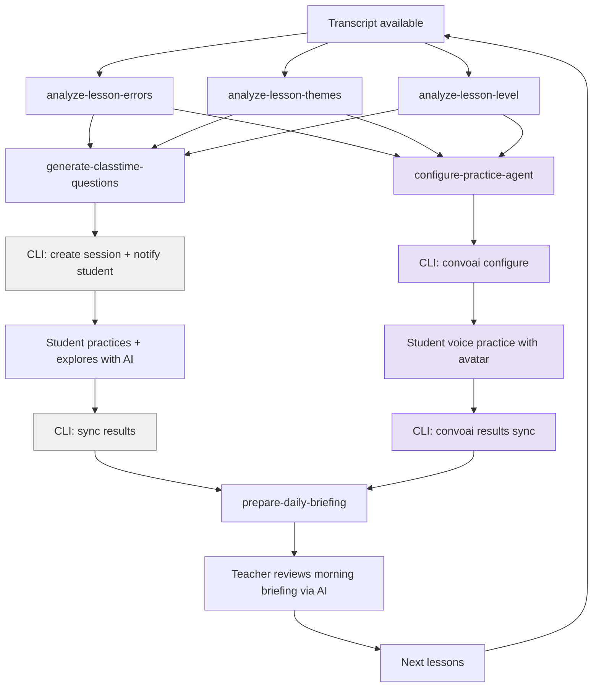

# Skill system

How AI workflows are structured, executed, tracked, and queried.
See [architecture.md](architecture.md) for how systems connect.
See [scaffolding.md](scaffolding.md) for repo structure and tech stack.
See [conversational-ux.md](conversational-ux.md) for how the AI chat
queries skill outputs.

## What a skill is

A self-contained AI workflow with defined inputs, reference materials,
steps, validation, and structured output. Skills chain together: the
output of one feeds the input of the next.

The key principle: reference materials ARE the quality spec. A skill
reads theory (error taxonomy, CEFR descriptors, question design guides)
before generating. Without good theory, skills produce generic output.

### Structure

Each skill is a directory in `.claude/skills/` with a SKILL.md and
optional reference materials.

```yaml
---
name: skill-name
description: What it produces
argument-hint: "<required_param> [optional_param]"
allowed-tools: Read, Write, Bash, Glob
---

## Params
- transcript: lesson transcript (JSON, speaker-tagged)
- student_id: Preply student identifier (optional, may not be linked yet)
- subject_type: e.g., "language", "math" (determines error taxonomy)
- subject_config: e.g., {"language_pair": "es-en", "l1": "Spanish", "l2": "English"}

## References (read before generating)
- references/error-taxonomy.md
- references/cefr-b1-descriptors.md

## Steps
1. Read all reference materials
2. Analyze transcript against error taxonomy
3. Categorize findings by type and severity
4. Validate: each error has transcript position, correction, explanation
5. Output structured JSON

## Output
{
  errors: [{ type, subtype, severity, communicative_impact, correction_strategy,
             exercise_priority, original, corrected, explanation, reasoning,
             l1_transfer, position: { utterance_index, timestamp, speaker,
             context_before, context_after } }],
  error_patterns: [{ pattern, count, error_indices, severity }],
  talk_ratio: { student_pct, teacher_pct },
  correction_summary: { recast, explicit, elicitation, self_correction, none },
  summary: { total_errors, by_type, by_severity, most_frequent, estimated_level }
}
```

### Skills vs CLI commands

A skill is where AI reasoning adds value - reading theory, analyzing data,
producing novel output. Everything else is a CLI command (mechanical API calls,
data transport, no judgment calls).

**Skills** (AI reads theory, reasons, produces novel output):

| Skill | What the AI does | Why it can't be a CLI command |
|-------|-----------------|-------------------------------|
| **analyze-lesson-errors** | Reads error taxonomy + transcript, categorizes errors with severity, corrections, explanations, reasoning | Requires linguistic judgment  - is this a grammar error or a vocabulary gap? How severe? Why? |
| **analyze-lesson-themes** | Reads transcript, extracts topics and vocabulary patterns the teacher built toward | Requires understanding pedagogical intent from conversation flow |
| **analyze-lesson-level** | Reads transcript + CEFR descriptors, assesses student level, identifies strengths and gaps | Requires holistic judgment  - matching conversation against level descriptors |
| **generate-classtime-questions** | Reads analysis results + question design theory, creates exercises with appropriate types and distractors | Requires pedagogical judgment  - what question type tests this error? What makes a good distractor? |
| **prepare-daily-briefing** | Reads all students' skill outputs + practice results for upcoming day, produces per-student reports with suggested focus | Requires synthesizing across multiple data sources and making teaching recommendations |

**CLI commands** (mechanical, no reasoning):

| Command | What it does | Why it's not a skill |
|---------|-------------|---------------------|
| `preply-lesson-ai transcripts fetch` | Fetch transcript from backend API | Data retrieval |
| `preply-lesson-ai skill-results push` | Upload skill output to backend | Data transport |
| `preply-lesson-ai classtime questions push` | Push generated questions to Classtime | API orchestration - questions already generated by skill |
| `preply-lesson-ai classtime session create` | Create Classtime session from question set | API orchestration |
| `preply-lesson-ai classtime session results` | Fetch answers + scores from Classtime | Data fetch |
| `preply-lesson-ai classtime session export` | Download XLSX results | Data fetch |
| `preply-lesson-ai daily-briefing push` | Upload daily briefing to backend | Data transport |
| `preply-lesson-ai pipeline start/complete` | Update pipeline stage status | Status update |
| `preply-lesson-ai convoai configure` | Configure ConvoAI agent with student context for voice practice | API orchestration - agent config already produced by skill |
| `preply-lesson-ai convoai session` | Create Agora ConvoAI session for a student | API call |

**The boundary**: if it needs to read theory and make judgments, it's a skill.
If it's calling APIs and moving data, it's a CLI command.

### MVP skills

Ordered by implementation priority:

1. **analyze-lesson-errors**  - most tangible output, prototype first. Feeds student practice mode + teacher briefing
2. **generate-classtime-questions**  - connects errors to Classtime. Closes the student practice loop
3. **analyze-lesson-themes**  - gives context to the errors. Enriches both student and teacher views
4. **analyze-lesson-level**  - CEFR assessment with strengths/gaps. Key for student "How is my level?" flow
5. **prepare-daily-briefing**  - aggregates all skill outputs + practice results per student for the teacher's morning overview

### Post-hackathon skills

- **analyze-lesson-gaps**  - cross-session reasoning: what student avoids, what's unpracticed

### ConvoAI skills

Skills that configure voice practice agents grounded in lesson analysis.
Same contract: structured input, reference materials, structured output
stored in `SkillExecution.output_data`.

| Skill | What the AI does | Why it can't be a CLI command |
|-------|-----------------|-------------------------------|
| **configure-practice-agent** | Reads error analysis + themes + level + Classtime session config, produces an agent system prompt and conversation plan for the ConvoAI avatar | Requires pedagogical judgment - which errors to weave into conversation, how to scaffold difficulty, when to correct vs. let the student self-correct |

### How skills and commands chain



Skills (white) do the reasoning. CLI commands (grey) move data. Purple nodes
are the ConvoAI branch - they consume the same skill outputs as the Classtime
branch but produce voice practice sessions. Classtime quiz results feed back
into the avatar in real-time. Both branches run in parallel.

### Design principles

- **Theory-driven**: read reference materials before generating
- **Pluggable**: add a new analysis skill without changing the chain
- **Trackable**: each execution has status with input and output stored
- **Progressive execution**: Phase 1 CLI-driven (hackathon), Phase 2 Temporal (post-hackathon). Same contract, same output_data
- **Parallel where possible**: analysis skills don't wait for each other
- **Multimodal output**: same skill outputs, multiple consumption surfaces (chat, Classtime, Agora ConvoAI voice practice)
- **Real-time adaptable**: same skill outputs feed both written exercises (Classtime) and voice practice (ConvoAI). Quiz results feed back into voice practice in real-time

---

## Skill execution

How skills get triggered, tracked, and queried. Skills run automatically
in the background  - the AI chat queries completed results.

### Data model

```python
class SkillExecutionStatus(models.TextChoices):
    PENDING = "pending"
    RUNNING = "running"
    COMPLETED = "completed"
    FAILED = "failed"

class SkillExecution(TimeStampedModel):
    teacher = ForeignKey(Teacher, on_delete=CASCADE, related_name="skill_executions")
    lesson = ForeignKey(Lesson, on_delete=CASCADE, null=True, blank=True,
                        related_name="skill_executions")
    student = ForeignKey(Student, on_delete=CASCADE, null=True, blank=True,
                         related_name="skill_executions")
    skill_name = CharField(max_length=100, db_index=True)
    status = CharField(max_length=20, choices=SkillExecutionStatus.choices, db_index=True)
    started_at = DateTimeField(null=True, blank=True)
    completed_at = DateTimeField(null=True, blank=True)
    input_data = JSONField(default=dict)
    output_data = JSONField(default=dict)
    output_log = TextField(blank=True)
    error = TextField(blank=True)
    exit_code = IntegerField(null=True, blank=True)

    class Meta:
        indexes = [
            Index(fields=["status", "-created"]),
            Index(fields=["student", "skill_name", "status"]),
            Index(fields=["lesson", "skill_name"]),
            Index(fields=["teacher", "skill_name", "-created"]),
        ]
        constraints = [
            CheckConstraint(
                check=Q(lesson__isnull=False) | Q(student__isnull=False),
                name="skill_exec_requires_lesson_or_student",
            ),
        ]
```

### State transitions

```
PENDING -----> RUNNING -----> COMPLETED
                  |
                  +---------> FAILED
```

- PENDING: created, waiting for worker to pick up
- RUNNING: worker claimed it, skill is executing
- COMPLETED: skill finished, output_data populated
- FAILED: skill errored, error + exit_code populated

### API endpoints

| Endpoint | Method | Who calls it | Purpose |
|----------|--------|-------------|---------|
| `/api/v1/skill-executions/` | POST | Pipeline / Temporal | Queue a skill for background execution |
| `/api/v1/skill-executions/pending/` | GET | Worker | Pick up next job |
| `/api/v1/skill-executions/{id}/` | PATCH | Worker / CLI | Update status, output |
| `/api/v1/students/{id}/skill-results/` | GET | AI chat (query tools) | Read completed skill outputs |
| `/api/v1/lessons/{id}/skill-results/` | GET | AI chat (query tools) | Read lesson-scoped skill outputs |
| `/api/v1/teachers/{id}/daily-briefing/` | GET | AI chat (query tools) | Read prepared daily briefing |

### Worker flow

```
Worker polls GET /api/v1/skill-executions/pending/ every 5s
  -> Gets [{id, skill_name, teacher_id, lesson_id, student_id (optional), input_data, status: "pending"}]
  -> PATCHes status = "running", started_at = now()
  -> Spawns: claude -p /{skill_name} {params}
  -> Captures stdout/stderr
  -> On success: PATCHes status = "completed", output_data = {structured JSON}
  -> On failure: PATCHes status = "failed", error = stderr, exit_code = N
```

### Execution phases

The skill pipeline evolves without breaking the contract.

**Phase 0: Manual (hackathon start)**

Run a skill by hand. No worker, no automation. The fastest way to iterate
on skill quality - tweak the prompt, re-run, compare output.

```bash
# 1. Fetch transcript from backend
preply-lesson-ai transcripts fetch <lesson_id>

# 2. Run the skill (Claude Code slash command)
# Reads theory + transcript, produces structured JSON → storage/skill-results/
preply-lesson-ai /analyze-lesson-errors <lesson_id>

# 3. Push output to backend
preply-lesson-ai skill-results push <lesson_id>
```

Or as a single command that does all three:

```bash
# Fetch → analyze → push in one step
preply-lesson-ai pipeline run <lesson_id> analyze-lesson-errors
```

The skill fetches its own input, reads theory references, analyzes, writes
structured JSON to `storage/skill-results/`, and the CLI pushes it to the
backend via `POST /api/v1/skill-results/`. The backend stores it in
`SkillExecution.output_data`. Query tools can read it immediately.

No worker process. No polling. No automation. Just a human running a
command and seeing the result. This is how you debug and iterate on skill
quality before automating anything.

**Phase 1: Worker automation (hackathon demo)**

A simple worker script automates what you did manually in Phase 0.
Still no Temporal - just a polling loop.

```bash
# Start the worker (runs in background)
python worker/skill_worker.py
```

- Worker polls for pending executions, spawns `claude -p /{skill_name}`
- Skills are Claude Code slash commands in the skills repo
- Same CLI push, same output format
- Good enough for the demo: lesson created → skills run automatically

**Phase 2: Temporal orchestration (post-hackathon)**

- Worker becomes a Temporal worker
- Skills become Temporal activities with retry policies
- `LessonAnalysisWorkflow` orchestrates the pipeline with parallelism
- Crash at step 5 = resume from step 5 (not restart)

**What never changes** (the contract):
- `SkillExecution` model with `output_data` JSONField
- Query tools reading from `output_data`
- The skill output format (errors, themes, level, questions)
- API endpoints for pushing/querying results
- The chat agent's tools - they read the same data regardless

See [02-state-persistence deep dive](deep-dives/02-state-persistence.md) for
the full progression with code examples.

### How the AI chat reads skill outputs

Skills run in the background. The AI chat queries completed results
via query tools (see [conversational-ux.md](conversational-ux.md)):

```
Student asks "What errors should I focus on?"
  -> AI calls query_errors tool
  -> Tool reads from SkillExecution.output_data
     where skill_name = "analyze-lesson-errors"
     and student_id = current student
  -> Returns (message, data) for ErrorAnalysisWidget
```

No polling. Query tools read the latest completed execution for a given
student + skill combination.

---

## Background pipeline

The entire skill chain runs automatically  - no UI interaction needed.

### Lesson pipeline (after each lesson)

```
1. ✓ Transcript fetched
2. ✓ analyze-lesson-errors     [parallel]
3. ✓ analyze-lesson-themes     [parallel]
4. ✓ analyze-lesson-level      [parallel]
5. ✓ generate-classtime-questions  [waits for 2-4]
6. ✓ Create Classtime session
7. ✓ Notify student
```

### Daily briefing pipeline (overnight)

```
1. Fetch upcoming students for tomorrow
2. For each student: pull latest skill outputs + practice results
3. prepare-daily-briefing produces per-student reports
4. Reports available for teacher's morning AI chat
```

### Execution history

Each student accumulates executions over time:
- Which skills ran for which lesson
- Success/failure rates
- Output data from any previous execution

Query tools read from this history to serve both the student practice
mode and teacher daily briefing mode.

---

## Deep dives needed

Research that feeds skill quality. Each deep dive produces a document
in `theory/` that skills reference.

### Language analysis

| Topic | What we need | Where it goes |
|-------|-------------|---------------|
| Error taxonomy | Categories, subcategories, severity levels, examples per language pair | `theory/error-taxonomy/` |
| CEFR level descriptors | What each level looks like in conversation | `theory/cefr-levels/` |
| Interlanguage patterns | Common L1 transfer errors by language pair | `theory/interlanguage/` |
| Transcript analysis | Parsing speaker-tagged transcripts, teacher corrections vs student errors | `theory/transcript-analysis/` |

**References:** CEFR companion volume, Corder (1967), James (1998), Selinker (1972)

### Question design

| Topic | What we need | Where it goes |
|-------|-------------|---------------|
| Question type mapping | Which Classtime type tests which skill | `theory/question-design/type-mapping.md` |
| Distractor generation | Plausible wrong answers per error type | `theory/question-design/distractors.md` |
| Difficulty calibration | Matching difficulty to CEFR level | `theory/question-design/difficulty.md` |

**References:** Haladyna et al. (2002), Bachman & Palmer (2010), classtime-api/hackathon-api-guide.md

### Progress tracking

| Topic | What we need | Where it goes |
|-------|-------------|---------------|
| Error persistence | When is an error "recurring"? Thresholds | `theory/progress-tracking/persistence.md` |
| Improvement metrics | Error frequency trends, complexity growth | `theory/progress-tracking/metrics.md` |
| Spaced repetition | When to resurface topics in practice | `theory/progress-tracking/spaced-repetition.md` |

**References:** Pimsleur (1967), Leitner system, Krashen (1982)

### ConvoAI integration

| Topic | What we need | Where it goes |
|-------|-------------|---------------|
| ConvoAI agent design | How to structure conversation plans from error data | `theory/convoai-agents/` |
| Voice correction pedagogy | When to correct vs. recast vs. let errors go in spoken practice | `theory/voice-correction/` |
| Biomarker-adaptive pacing | How stress/confidence signals should modify conversation difficulty | `theory/biomarker-pedagogy/` |

**References:** Agora ConvoAI documentation, Anam avatar API, Thymia Sentinel API, second language acquisition research on corrective feedback

---

## Key design patterns

### Two-phase execution

Every skill runs in two phases:
1. **Plan** (read-only): read reference materials, analyze input, prepare approach
2. **Act**: generate output, validate, write structured JSON

The plan phase prevents the AI from generating before it understands the
context. Reading theory first grounds the output in real frameworks.

### Theory-driven quality

Reference materials in `theory/` define what good output looks like. The
error taxonomy tells the skill what counts as a grammar error vs a vocabulary
gap. The CEFR descriptors tell it what errors are expected at B1 vs unexpected.
Without these, the AI guesses. With them, it applies consistent criteria.

### Execution tracking

Every skill run is a SkillExecution record with status, input, output. This
means:
- The pipeline knows what succeeded and what to retry
- Failed runs have error logs for debugging
- Completed runs have structured output that query tools can read
- History accumulates per student for cross-session analysis

### Skill output requirements

Skills must include `reasoning` in their output  - explaining what framework
was applied and why. This powers the trust/transparency layer in the AI chat
(see [conversational-ux.md](conversational-ux.md)):

```json
{
  "type": "grammar",
  "severity": "moderate",
  "reasoning": "Error taxonomy: morphological > verb tense. B1 should have acquired past simple."
}
```

### Enriched output fields

Fields added from tutoring research (CLT, TBLT, ZPD, formative assessment).
Each field serves one or more consumers: AI chat (C), Classtime questions (Q),
teacher briefing (B).

| Skill | Field | Consumers | Purpose |
|-------|-------|-----------|---------|
| **errors** | `correction_strategy` | C, B | How tutor handled the error (recast/explicit/elicitation/self_correction/none) |
| **errors** | `communicative_impact` | Q, B | Does the error impede understanding? (low/medium/high) |
| **errors** | `exercise_priority` | Q | Pre-computed 1-5 priority for question generation |
| **errors** | `l1_transfer` | C, Q | L1 interference explanation string (drives distractors) |
| **errors** | `error_patterns` | Q, B | Grouped recurring errors, each a candidate exercise focus |
| **errors** | `talk_ratio` | C, B | Student vs teacher speaking time |
| **errors** | `correction_summary` | B | Aggregate correction strategy counts |
| **themes** | `communicative_function` | C | CLT task type (narrating, planning, arguing...) |
| **themes** | `vocabulary.active/passive` | Q | Active = student produced, passive = teacher used. Drives production vs recognition |
| **themes** | `chunks` | Q | Multi-word expressions usable as GAP templates |
| **themes** | `key_errors` | Q | Cross-reference to errors occurring in this theme |
| **level** | `zpd` | Q | Zone of Proximal Development boundaries and stretch topics |
| **level** | `gaps[].exercise_focus` | Q | Marks which gaps should become exercises |
| **level** | `suggestions[].for_teacher/for_student` | C, B | Separate teacher vs student actionables |
| **questions** | `difficulty` | Q | ZPD-calibrated: zpd_lower/zpd_target/zpd_stretch |
| **questions** | `lesson_context` | Q | Student's actual error moment with timestamp |
| **questions** | `pattern_coverage` | B | Maps error patterns to question indices for per-pattern results |
| **questions** | `distractor_rationale` | C | Why each wrong answer was chosen |
| **briefing** | `pattern_mastery` | B | Error pattern + practice score + status (improving/persistent/new) |
| **briefing** | `teachable_moments` | B | Self-corrections, breakthroughs from the lesson |
| **briefing** | `attention_priority` | B | Students ordered by urgency |

### ConvoAI skill output formats

```python
# configure-practice-agent output
{
    "agent_system_prompt": str,       # Full system prompt for ConvoAI LLM
    "conversation_plan": [{
        "topic": str,                  # e.g., "Past tense in narratives"
        "target_errors": [int],        # Indices into error analysis
        "difficulty": str,             # "guided" | "open" | "challenge"
        "prompts": [str],             # Conversation starters
    }],
    "correction_strategy": str,       # "recast" | "explicit" | "elicitation"
    "biomarker_thresholds": {
        "stress_high": float,         # When to slow down / encourage
        "confidence_low": float,      # When to scaffold more
    },
    "reasoning": str,                 # Why this plan for this student
}
```

### Automatic chaining

Skills chain automatically in the background pipeline. Analysis skills run
in parallel. generate-classtime-questions waits for all analysis. Session
creation and student notification happen without teacher interaction.
prepare-daily-briefing runs overnight before the teacher's day.

---

## Classtime CLI commands

Backend service layer for Classtime API. These are mechanical CLI commands
(not skills) that move data between our backend and Classtime.

Backend implementation: `apps/classtime_sessions/services/`
API reference: [classtime-api-guide.md](classtime-api-guide.md) (section 0)

### Service modules

| Module | API surface | Functions |
|--------|------------|-----------|
| `questions.py` | REST API | `create_question_set`, `create_question`, `create_questions_batch` |
| `sessions.py` | Proto API | `create_practice_session`, `get_session_details`, `list_sessions`, `end_session` |
| `results.py` | Proto API | `get_answers_summary`, `get_detailed_answers`, `suggest_comment`, `save_comment`, `export_session` |
| `schemas.py` | - | `BooleanPayload`, `SingleChoicePayload`, `GapPayload`, `SorterPayload`, `CategorizerPayload` |
| `client.py` | Both | `rest_post`, `rest_get`, `proto_call` |

### CLI command: `classtime questions push`

Takes skill output from `generate-classtime-questions` and pushes to Classtime.

```
Input:  SkillExecution.output_data from generate-classtime-questions
Output: question_set_id, [question_ids]

Steps:
1. Read skill output (questions array + session_title)
2. create_question_set(title)
3. For each question: create_question(qs_id, payload)
4. Store question_set_id + question_ids on ClasstimeSession model
```

### CLI command: `classtime session create`

Creates a Classtime session from a question set.

```
Input:  question_set_id, title, feedback_mode (from skill output)
Output: session_code, student_url

Steps:
1. create_practice_session(qs_id, title, feedback_mode)
2. Store session_code on ClasstimeSession model
3. Return student URL: https://www.classtime.com/student/login/{code}
```

### CLI command: `classtime session results`

Fetches student answers and scores from a completed session.

```
Input:  session_code
Output: list[AnswerSummary] with correctness, points, per-gap results

Steps:
1. get_answers_summary(session_code)
2. Optionally: get_detailed_answers(code, question_id) for full answer content
3. Store in ClasstimeSession.results_data
```

### CLI command: `classtime session export`

Downloads session results as XLSX.

```
Input:  session_code
Output: download URL

Steps:
1. export_session(session_code, "INSIGHTS_XLSX")
2. Return URL
```

### Pipeline integration

These commands slot into the lesson pipeline after the
`generate-classtime-questions` skill completes:

```
5. generate-classtime-questions completes
   -> output_data: {questions: [...], session_title, feedback_mode}

6. classtime questions push
   -> reads output_data
   -> creates QS + questions in Classtime
   -> stores question_set_id

7. classtime session create
   -> creates session from QS
   -> stores session_code
   -> student URL ready

8. Student completes practice (async, on Classtime)

9. classtime session results
   -> fetches answers + scores
   -> stores in results_data
   -> feeds prepare-daily-briefing skill
```

### Question payload examples

The `generate-classtime-questions` skill output includes a `classtime_payload`
per question matching these schema types:

```python
from apps.classtime_sessions.services.schemas import (
    BooleanPayload,
    SingleChoicePayload, SingleChoiceOption,
    GapPayload, Gap, GapChoice,
    SorterPayload,
    CategorizerPayload, CategorizerItem,
    draftjs_rich, draftjs_blocks, draftjs_bold, draftjs_italic,
)

# Boolean: true/false statement
BooleanPayload(
    title="'I have been to Paris last year' is correct",
    is_correct=False,
    explanation="Use simple past with 'last year'.",
)

# Single choice: pick one correct answer
SingleChoicePayload(
    title="Which sentence is correct?",
    choices=[
        SingleChoiceOption(text="She don't like coffee", is_correct=False),
        SingleChoiceOption(text="She doesn't like coffee", is_correct=True),
    ],
    explanation="Third person singular: doesn't.",
)

# Sorter: arrange in correct order (Classtime shuffles for display)
SorterPayload(
    title="Arrange to form a correct sentence",
    items=["I", "went", "to", "the store"],
    explanation="Subject-Verb-Preposition-Object.",
)

# Categorizer: classify items into categories
CategorizerPayload(
    title="Sort by grammatical gender",
    categories=["Masculine", "Feminine", "Neuter"],
    items=[
        CategorizerItem(text="der Tisch", category_index=0),
        CategorizerItem(text="die Lampe", category_index=1),
        CategorizerItem(text="das Buch", category_index=2),
    ],
    explanation="der = masculine, die = feminine, das = neuter.",
)
```

### Fill-in-the-gap (GAP) - the most powerful question type

GAP is the primary question type for language learning. It supports free-text
input (BLANK), dropdowns (CHOICES), and any mix in a single sentence or
paragraph. The AI skill should prefer GAP for most error types.

**Template syntax:** `{0}`, `{1}`, `{2}` are placeholders for gaps. They map
to the `gaps` array by index. The service layer converts them to `[UUID]`
format for the Classtime API.

**Gap types:**
- `blank` - student types free text. Auto-graded, case-insensitive.
  Best for: verb conjugation, spelling, word recall.
- `choices` - student picks from dropdown. Multiple distractors.
  Best for: prepositions, articles, confusable forms.

**Error type to gap type mapping:**

| Error type | Gap type | Why |
|-----------|----------|-----|
| Verb tense/conjugation | `blank` | Active recall forces production |
| Irregular past tense | `blank` | Student must remember the form |
| Prepositions | `choices` | Finite set, recognition-based |
| Articles (a/an/the, der/die/das) | `choices` | Grammatical selection |
| Word order within phrase | `choices` | Choose the right word |
| Collocations (make/do a mistake) | `choices` | Fixed pairings |
| Spelling correction | `blank` | Must produce correct form |
| Sentence transformation | `blank` | Rewrite in target form |

```python
# --- BLANK gap examples ---

# 1. Single blank - verb conjugation
GapPayload(
    title="Past tense: irregular verb",
    template_text="Yesterday I {0} to the cinema with my friends.",
    gaps=[Gap(type="blank", solution="went")],
    explanation=draftjs_rich(
        "went is the irregular past tense of go.",
        [(0, 4, "BOLD")],
    ),
    content=draftjs_rich(
        "The student said: 'I goed to the cinema'",
        [(19, 21, "ITALIC")],
    ),
)

# 2. Multiple blanks - conjugation drill
GapPayload(
    title="Fill in ALL past tense forms",
    template_text="I {0} up early, {1} breakfast, and {2} to work.",
    gaps=[
        Gap(type="blank", solution="woke"),
        Gap(type="blank", solution="had"),
        Gap(type="blank", solution="drove"),
    ],
    explanation=draftjs_blocks([
        ("wake -> woke (irregular)", [(0, 11, "BOLD")]),
        ("have -> had (irregular)", [(0, 10, "BOLD")]),
        ("drive -> drove (irregular)", [(0, 12, "BOLD")]),
    ]),
)

# --- CHOICES gap examples ---

# 3. Single choices - preposition
GapPayload(
    title="Choose the correct preposition",
    template_text="She is very good {0} playing the piano.",
    gaps=[
        Gap(type="choices", choices=[
            GapChoice(content="at", is_correct=True),
            GapChoice(content="in", is_correct=False),
            GapChoice(content="on", is_correct=False),
            GapChoice(content="for", is_correct=False),
        ]),
    ],
    explanation=draftjs_rich(
        "good at + gerund is the correct collocation.",
        [(0, 7, "BOLD")],
    ),
)

# 4. Multiple choices - German articles with cases
GapPayload(
    title="Choose the correct German article",
    template_text="{0} Hund liegt auf {1} Sofa neben {2} Lampe.",
    gaps=[
        Gap(type="choices", choices=[
            GapChoice(content="Der", is_correct=True),
            GapChoice(content="Die", is_correct=False),
            GapChoice(content="Das", is_correct=False),
        ]),
        Gap(type="choices", choices=[
            GapChoice(content="dem", is_correct=True),
            GapChoice(content="den", is_correct=False),
            GapChoice(content="der", is_correct=False),
        ]),
        Gap(type="choices", choices=[
            GapChoice(content="der", is_correct=True),
            GapChoice(content="dem", is_correct=False),
            GapChoice(content="die", is_correct=False),
        ]),
    ],
    explanation=draftjs_blocks([
        ("Hund = masculine -> Der (nominative)", [(0, 4, "BOLD")]),
        ("Sofa = neuter, auf + dative -> dem", [(0, 4, "BOLD")]),
        ("Lampe = feminine, neben + dative -> der", [(0, 5, "BOLD")]),
    ]),
)

# --- MIXED blank + choices ---

# 5. Mixed in one sentence
GapPayload(
    title="Complete with the correct past forms",
    template_text="Last week she {0} a cake and {1} it to her neighbor.",
    gaps=[
        Gap(type="blank", solution="baked"),
        Gap(type="choices", choices=[
            GapChoice(content="gave", is_correct=True),
            GapChoice(content="gived", is_correct=False),
            GapChoice(content="given", is_correct=False),
        ]),
    ],
    explanation=draftjs_blocks([
        ("baked is regular (bake -> baked).", [(0, 5, "BOLD")]),
        ("gave is irregular (give -> gave -> given).", [(0, 4, "BOLD")]),
    ]),
)

# --- Paragraph-level (cloze-style) ---

# 6. Extended passage with mixed gaps
GapPayload(
    title="Complete the paragraph",
    template_text=(
        "When I {0} young, I {1} to play outside every day. "
        "My friends and I {2} ride our bikes to the park "
        "and {3} there until sunset."
    ),
    gaps=[
        Gap(type="choices", choices=[
            GapChoice(content="was", is_correct=True),
            GapChoice(content="were", is_correct=False),
        ]),
        Gap(type="choices", choices=[
            GapChoice(content="used", is_correct=True),
            GapChoice(content="use", is_correct=False),
        ]),
        Gap(type="choices", choices=[
            GapChoice(content="would", is_correct=True),
            GapChoice(content="will", is_correct=False),
        ]),
        Gap(type="blank", solution="stay"),
    ],
)

# --- Sentence correction pattern ---

# 7. Show the error, student picks the fix
GapPayload(
    title="Correct the error",
    template_text="She {0} not like coffee.",
    gaps=[
        Gap(type="choices", choices=[
            GapChoice(content="doesn't", is_correct=True),
            GapChoice(content="don't", is_correct=False),
            GapChoice(content="not", is_correct=False),
        ]),
    ],
    content=draftjs_blocks([
        ("The student said:", None),
        ("'She don't like coffee'", [(1, 21, "ITALIC"), (5, 5, "BOLD")]),
    ]),
)
```

**Design guidelines for the AI skill:**
- Prefer `blank` for production tasks (verb forms, spelling) - harder, more learning
- Prefer `choices` for recognition tasks (prepositions, articles) - scaffolded
- Use 3-4 distractors per choices gap. Include the student's actual error as one
- Mix blank + choices in one question when testing different skills
- For paragraphs, 3-5 gaps is optimal. More feels overwhelming
- Always include the student's original error in the `content` field (italicized)
- Bold the correct form in the explanation

### Session feedback modes

The skill output includes a `feedback_mode` field that maps to session presets:

| Mode | Student experience | When to use |
|------|-------------------|-------------|
| `practice` | Right/wrong after each answer, solution hidden | Default. Error drills, grammar, vocabulary |
| `after_submit` | Answer all, then see total score. Solutions hidden | Comprehensive review, self-assessment |
| `reveal_answers` | Right/wrong + solution + explanation after each answer | Review mode, after student completed practice |
